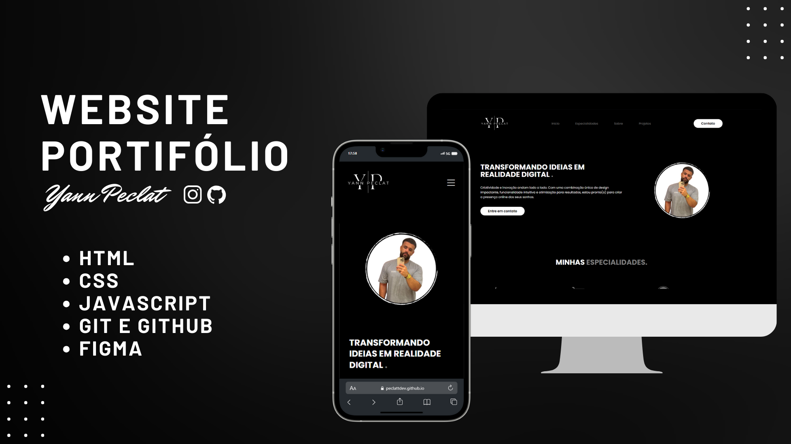

<h1 align="center"> Website Portifólio </h1>

Este projeto envolve a criação de um website personalizado para ser exibido como um portfólio. O objetivo principal é fornecer um espaço online atraente e informativo que destaque as habilidades, experiências e conquistas do indivíduo ou da empresa.  

  <a href="#-tecnologias">Tecnologias</a>&nbsp;&nbsp;&nbsp;|&nbsp;&nbsp;&nbsp;
  <a href="#-projeto">Projeto</a>&nbsp;&nbsp;&nbsp;|&nbsp;&nbsp;&nbsp;
  <a href="#memo-licença">Licença</a>

  

## 🚀 Tecnologias

Esse projeto foi desenvolvido com as seguintes tecnologias:

- HTML e CSS
- JavaScript
- Git e Github
- Figma

## 💻 Projeto

Esse website foi idealizado para uso pessoal ou de empresas como um pagina de apresentação dos seus projetos, com funcionalidades de envio de formulario e opções de contato.

## :memo: Licença

Esse projeto está sob a licença MIT.

---

Feito com ♥ by Yann Peclat
